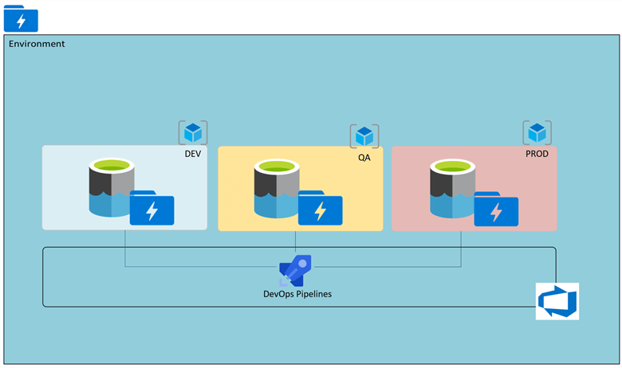

# End-to-End Azure Data Engineering Project
> Data source: Adventure Works dataset  
> Repository: End-to-End-Data-Engineering-Project  
> Author: Dulla

This project demonstrates how to design and implement a complete modern data pipeline using:

- Azure Data Factory (ADF) for ingestion
- Azure Data Lake Gen2 for storage (Bronze, Silver, Gold layers)
- Databricks (Apache Spark) for transformation
- Azure Synapse Analytics for warehousing
- Power BI for reporting

The goal is to show how raw data flows through a structured lakehouse architecture and becomes analytics-ready.

---

## Takeaway from this exercise

- How to design and implement a robust data pipeline using Azure Data Factory
- The process of data integration and transformation with Databricks
- Utilizing Azure Synapse Analytics for efficient data warehousing
- Best practices for handling big data solutions using Apache Spark
- Practical implementation of Bronze → Silver → Gold architecture

---
## Architecture Overview

- **Data Source**
  - GitHub (Adventure Works CSV files)

- **Ingestion Layer**
  - Azure Data Factory
    - GitToRaw (Static pipeline)
    - DynamicCopy (Parameterized + ForEach)

- **Storage Layer (ADLS Gen2)**
  - bronze
  - silver
  - gold
  - parameter (git.json)

- **Processing Layer**
  - Azure Databricks (Apache Spark transformations)

- **Serving Layer**
  - Azure Synapse Analytics (External tables & views)

- **Visualization**
  - Power BI


# Phase 1 — Bronze Layer (Ingestion with ADF)

### Data Source
- Adventure Works dataset downloaded from Kaggle
- Uploaded to GitHub repository
- ADF uses HTTP linked service to pull raw CSV files from GitHub

### Storage Setup
- Created Azure Data Lake Gen2
- Enabled **Hierarchical Namespace**
- Created containers:
  - bronze
  - silver
  - gold
  - parameter (for dynamic ingestion config)

### Static Pipeline (GitToRaw)
- HTTP Linked Service → Data Lake Gen2
- CSV dataset
- Data copied into bronze container

### Dynamic Pipeline (DynamicCopy)
To avoid manually copying files:

- Parameters for:
  - Relative URL
  - Folder name
  - File name
- Lookup activity reads `git.json`
- ForEach iterates through items
- Dynamic content populates source and sink paths

Example dynamic expression:

```
@activity('LookupGit').output.value
@item().p_relurl
```
The list of files to ingest dynamically is controlled by `git.json` located in:

/parameter/git.json

This file is read by the Lookup activity and passed into the ForEach loop to automate ingestion.

---


# Phase 2 — Silver Layer (Transformation with Databricks)

### Infrastructure
- Created Azure Databricks workspace
- Created classic compute cluster (non-serverless)
- Microsoft Entra ID App Registration
- Assigned **Storage Blob Data Contributor** role

### Connection Template

```python
storage_account = "<storage-account-name>"
tenant_id = "<tenant-id>"
client_id = "<service-principal-client-id>"
client_secret = "<service-principal-client-secret>"

spark.conf.set(f"fs.azure.account.auth.type.{storage_account}.dfs.core.windows.net", "OAuth")
spark.conf.set(f"fs.azure.account.oauth.provider.type.{storage_account}.dfs.core.windows.net",
               "org.apache.hadoop.fs.azurebfs.oauth2.ClientCredsTokenProvider")
spark.conf.set(f"fs.azure.account.oauth2.client.id.{storage_account}.dfs.core.windows.net",
               client_id)
spark.conf.set(f"fs.azure.account.oauth2.client.secret.{storage_account}.dfs.core.windows.net",
               client_secret)
spark.conf.set(f"fs.azure.account.oauth2.client.endpoint.{storage_account}.dfs.core.windows.net",
               f"https://login.microsoftonline.com/{tenant_id}/oauth2/token")
```

### Reading from Bronze

```python
df = spark.read.format('csv')     .option("header", True)     .option("inferSchema", True)     .load('abfss://bronze@<storage-account>.dfs.core.windows.net/AdventureWorks_Calendar')
```


### Writing to Silver (Parquet)

```python
df.write.format('parquet')   .mode('append')   .option('path','abfss://silver@<storage-account>.dfs.core.windows.net/AdventureWorks_Calendar')   .save()
```
Transformation logic can be found in the Databricks notebook located in this repository under the Silver Layer scripts.

---

# Phase 3 — Gold Layer (Synapse Analytics)

### Setup
- Created Azure Synapse workspace
- Configured SQL admin credentials
- Assigned Managed Identity access to Data Lake


### Creating Views from Silver

```sql
CREATE VIEW gold.calendar AS
SELECT *
FROM OPENROWSET(
    BULK 'https://<storage-account>.blob.core.windows.net/silver/AdventureWorks_Calendar/',
    FORMAT = 'PARQUET'
) AS data;
```

### External Tables
- Created schema `gold`
- Created external tables referencing parquet data
- Optimized with parquet compression

---

# Reporting with Power BI

- Connected Power BI to Synapse Serverless SQL endpoint
- Authenticated using SQL admin credentials
- Built dashboards from Gold layer tables

---
All SQL scripts for creating views and external tables are available in:

gold_layer.sql

# Cost Optimization & Alternatives

| Option | Pros | Cons | Best For |
|-------|------|------|----------|
| Full Azure Stack (ADF + DBX + Synapse) | Scalable, enterprise-ready | Expensive | Large organizations |
| Databricks + DBFS only | Cheap, simple | Not cloud-native | Learning & prototyping |
| Azure Functions + ADLS + Synapse | Lower cost ingestion | Less orchestration | Medium workloads |
| Local Spark + Upload to ADLS | Very cheap | Manual ops | Small datasets |
| AWS/GCP equivalents | Competitive pricing | Migration effort | Multi-cloud teams |

### Recommendation
- **Small Data Teams**: Databricks + DBFS or Local Spark
- **Medium Teams**: ADF + ADLS + Databricks
- **Large Enterprises**: Full Azure Lakehouse + Synapse

---

## Key Takeaways

- Separation of storage layers improves data quality
- Dynamic pipelines reduce manual effort
- Parquet format improves performance
- Lakehouse architecture is scalable and modular
- Cloud authentication can be complex — design for simplicity

---

## Challenges Faced During Implementation

While implementing this project, several real-world cloud engineering challenges were encountered:

- Databricks authentication with ADLS (OAuth, Secret Scopes, RBAC)
- Serverless vs Classic compute limitations
- Key Vault and Managed Identity configuration
- Dynamic parameter passing in ADF pipelines
- Cost management as no resource in the cloud, is free


